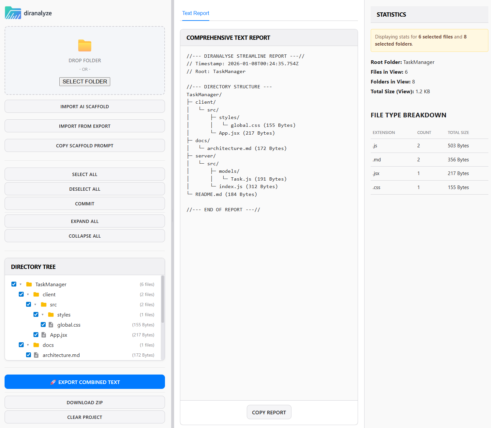

# Mashu



Browser tool for selecting files and combining them into a single text export.

## What it does

- Drop a folder, see the full tree
- Select files/folders to include
- Export as a single text file (great for feeding to LLMs)
- Import AI-generated scaffolds and write them to disk
- Syntax-highlighted file preview

## Use cases

- Pack a codebase into one file for Claude/ChatGPT
- Generate project scaffolds from AI output
- Quick directory analysis without CLI tools

## Run locally

```bash
npm install
npm run dev
```

## Build

```bash
npm run build
```

## Deploy to GitHub Pages

Mashu now ships with a GitHub Pages workflow at [.github/workflows/pages.yml](C:\Users\SpencerNunamakerTrav\mashu\.github\workflows\pages.yml).

1. Push `main` to GitHub.
2. In the repository, go to `Settings -> Pages`.
3. Under `Build and deployment`, set `Source` to `GitHub Actions`.
4. The workflow will build `dist/` and deploy it to Pages on every push to `main`.

`vite.config.ts` uses a relative `base` so the same build works both at the default Pages URL and at a future custom domain without a repo-specific path override.

## Custom Domain

1. In `Settings -> Pages`, enter the custom domain before changing DNS.
2. For a subdomain such as `www.example.com` or `mashu.example.com`, create a `CNAME` record pointing to `<your-github-username>.github.io`.
3. For an apex domain such as `example.com`, create `A` records pointing to:
   `185.199.108.153`
   `185.199.109.153`
   `185.199.110.153`
   `185.199.111.153`
4. Optionally add the GitHub Pages IPv6 `AAAA` records if your DNS provider supports them.
5. If you use an apex domain, also set up `www` as a `CNAME` to `<your-github-username>.github.io` so GitHub can redirect cleanly between the apex and `www`.
6. After DNS resolves, enable `Enforce HTTPS` in the Pages settings.

Notes:
GitHub does not require a committed `CNAME` file when you publish from a custom GitHub Actions workflow.
Avoid wildcard DNS records such as `*.example.com`; GitHub warns they increase takeover risk.
DNS and HTTPS provisioning can take time to propagate, so expect some delay after the first configuration.

## Stack

- TypeScript
- Vite
- File System Access API
- CodeMirror (syntax highlighting)

## Notes

This started as vanilla HTML/JS in 2025. Refactored to TypeScript in 2026.

Uses Rust-style `Result<T, E>` and `Option<T>` patterns for error handling instead of try/catch.

## License

MIT
